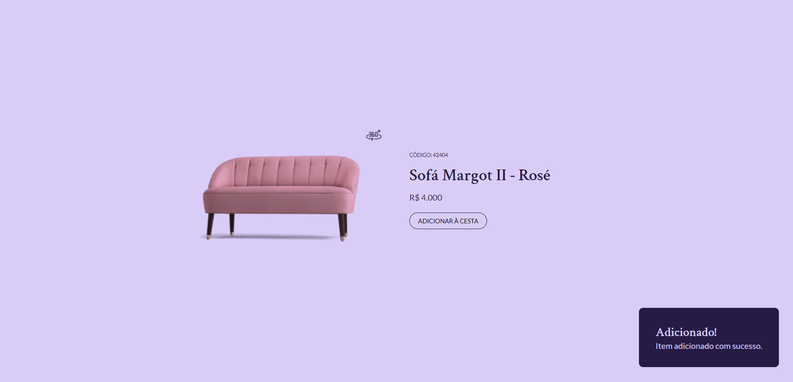

# 🛒 Product Card

## About 

Product Card built on #boraCodar challenge.
  
New features was add as Toast and tests.

## Applied technologies

- Built with [Vite](https://vitejs.dev/);
- [Stiches](https://stitches.dev/) for styles;
- Tooltip and Progress bar UI component from [Radix](https://www.radix-ui.com/);
- [Cypress](https://www.cypress.io/) to manage tests.

## Layout

## Access the application 

- [Deploy]()
- Type `npm run dev` to run the application on localhost

## Aditional infos

- Author: [Yasmin](https://www.linkedin.com/in/yasmin-goncalves/)
- Challenge by [Rocketseat](https://www.rocketseat.com.br/)